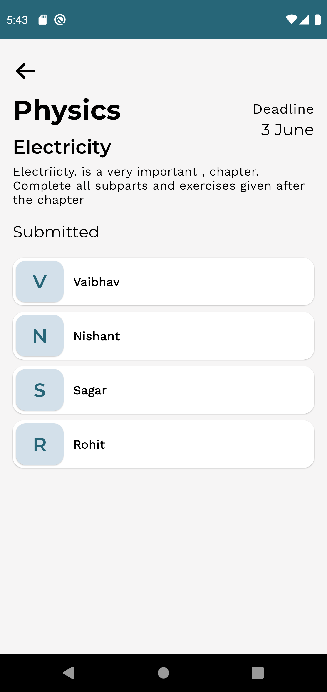

# **AssignmentHub** 

**AssignmentHub** is a assignment managing Android application 📱 built for **E-Hack VIT Hackathon** and also demonstrate use of *Modern Android development* tools.

## Setup
Clone the repository on your machine. Open the project on your IDE and connect it to firebase.
Set up Firebase Auth with email and password authentication. Enable Firestore too.

## About

AssignmentHub ia an app for teachers and student to manage and keep track of their assignments.
Teachers can also create assignments from the app. Students can also submit their assignments from the app.

- Fully functionable. 
- Clean and Simple Material UI.

# 🎬 Video Presentation 

You can watch the video presentation of the AssignmentHub in https://youtu.be/WCIXUYuKaV0

## 📸 Screenshots

||||
|:----------------------------------------:|:-----------------------------------------:|:-----------------------------------------: |
|  |  |  |
|  |  |  |
|  |  |  |

## Built With 🛠
- [Kotlin](https://kotlinlang.org/) - First class and official programming language for Android development.
- [Coroutines](https://kotlinlang.org/docs/reference/coroutines-overview.html) - For asynchronous and more..
- [Android Architecture Components](https://developer.android.com/topic/libraries/architecture) - Collection of libraries that help you design robust, testable, and maintainable apps.
  - [LiveData](https://developer.android.com/topic/libraries/architecture/livedata) - Data objects that notify views when the underlying database changes.
  - [ViewModel](https://developer.android.com/topic/libraries/architecture/viewmodel) - Stores UI-related data that isn't destroyed on UI changes. 
- [Dependency Injection](https://developer.android.com/training/dependency-injection) - 
  - [Hilt-Dagger](https://dagger.dev/hilt/) - Standard library to incorporate Dagger dependency injection into an Android application.
  - [Hilt-ViewModel](https://developer.android.com/training/dependency-injection/hilt-jetpack) - DI for injecting `ViewModel`.
- [Backend](https://firebase.google.com) - Google Firebase
  - Firebase Auth - To support email based authentication
  - Firebase Firestore - A NoSQL database to store all data 
  - Firebase Storage - A clous storage to store all images
- [GSON](https://github.com/google/gson) - A modern JSON library for Kotlin and Java.
- [Timber](https://github.com/JakeWharton/timber) - A simple logging library for android.
- [Glide](https://github.com/bumptech/glide) - An image loading library for Android backed by Kotlin Coroutines.
- [Material Components for Android](https://github.com/material-components/material-components-android) - Modular and customizable Material Design UI components for Android.

# Package Structure
    
    com.vaibhav.assignmenthub    # Root Package
    .
    ├── data                # For data handling.
    │   ├── models          # Model Data Classes
    |   └── repo            # Single source of thruth
    |
    ├── di                  # Dependency Injection             
    │   └── module          # DI Modules
    |
    ├── ui                  # UI/View layer
    │   ├── adapters        # All listAadpters
    |   └── screens         # All Activities, its fragments and viewmodels
    |   
    └── utils               # Utility Classes / Kotlin extensions

## Architecture
This app uses [***MVVM (Model View View-Model)***](https://developer.android.com/jetpack/docs/guide#recommended-app-arch) architecture.

 ## Contact
If you need any help, you can connect with me.

Visit:- [VaibhavJaiswal.io](https://vaibhav2002.github.io)
